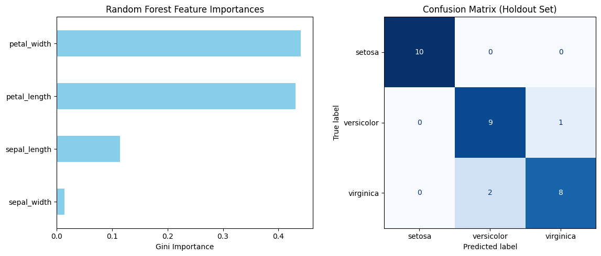

# Iris Species Classification Engine

An end-to-end Machine Learning pipeline implemented in Python using **Scikit-Learn** and **Pandas**. This project trains an ensemble **Random Forest Classifier** to accurately categorize botanical species based on morphological measurements.

---

## 📋 Overview

The objective of this project is to build a robust multiclass classification engine on tabular data. The workflow covers data preprocessing, feature-target decoupling, train/test splitting, model training with ensemble decision trees, and performance metric evaluation.

### Key Metrics & Tech Stack
* **Language:** Python 3.10+
* **Core Libraries:** `pandas`, `seaborn`, `scikit-learn`, `matplotlib`
* **Model:** Random Forest Classifier (50 Estimators)
* **Task Type:** Multiclass Supervised Classification

---

## 📊 Model Evaluation & Visualisations

### Cross-Validation
To ensure the model generalizes well across different subsets of data, a **5-Fold Cross-Validation** strategy was applied to the training set:
* **Mean CV Score:** 95%
* **Holdout Test Score:** 90%

### Visual Outputs
Running `main.py` automatically generates and saves performance plots (`model_visualisations.png`):

1. **Feature Importance:** Highlights the relative predictive contribution of each morphological feature (`petal_width` and `petal_length` consistently dominate).
2. **Confusion Matrix:** Displays true vs. predicted counts across classes on the unseen test set to identify classification confusion.

| Feature Importances & Confusion Matrix |
|:--:|
|  |

---

## 🛠️ Project Structure

```text
├── main.py              # Main execution script containing full pipeline
├── model_visualisations.png # Generated performance plots
├── README.md            # Project documentation
└── requirements.txt     # Python dependencies
